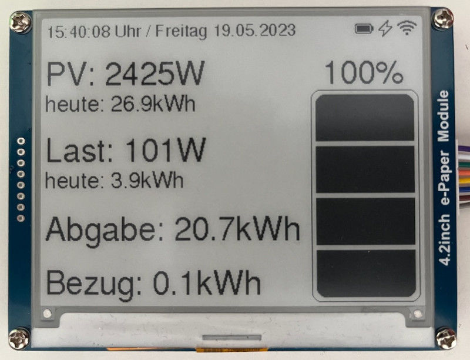

# What is this?

This is a live display for an AlphaESS solar inverter. It is built around an ESP32
MCU and displays output, load and battery level on a Waveshare 4.1" grayscale eInk
display (which uses a UC8176 EPD controller). The values are fetched from the AlphaESS
cloud using the official [API](https://github.com/alphaess-developer/alphacloud_open_api).

</img>

# Building

You need ESP-IDF 5.0 (or higher) to build this project. Copy `main/config_local.example.h`
to `main/config_local.h` and edit it to reflect you wifi credentials, inverter S/N and API
credentials.

Other parameters can be changed in `main/config.h`, including all display text. This is
also the place where you can find and modifiy the pinout for connecting the Waveshare
display.

After adjusting the configuration, the flash image can be built and flashed with

```
    $ idf.py flash
```

# Included software

The display code is derived from a modified version of the
[Adafruit gfx library](https://github.com/adafruit/Adafruit-GFX-Library).

HTTP2 requests are performed using [nghttp2](https://nghttp2.org) (as an
IDF package) and a modified version of
[sh2lib](https://github.com/espressif/esp-va-sdk/blob/master/components/sh2lib/sh2lib.h).

The status icons are derived from the [Ionic icon set](https://ionic.io/ionicons).

# License

You are free to use and modifiy this project under the terms of the GPLv3. Please
contact me if you desire to use the code under different licensing terms.
